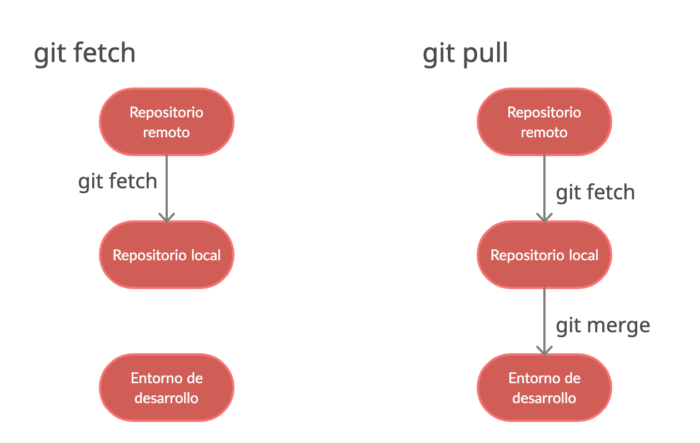

# GitHub

**Terminal**  
[My_Github](https://github.com/Ceristh/markdown)  

## clonar repositorio.  
~~~
git clone https://github.com/Ceristh/markdown.git
~~~

## comandos frecuentes.  
~~~
git --version
git config --list
git config --global user.name "ceristh"
git status
git log
git reset HEAD
git diff
git checkout (bracnh=rama)
git checkout master
git checkout main
~~~

## Primero crear repositorio en github.  
~~~
git init -b main
git add . && git commit -m "initial commit"
git remote add origin https://github.com/Ceristh/markdown.git
git push -u origin main
~~~

## Cambios en repositorio.  
~~~
git add . && git commit -m "actualización"
git push
~~~

## Diferencia entre git pull y git fetch.    

+ Repositorio remoto: sería el que se almacena en GitHub.  
+ Repositorio local: es una copia del repositorio remoto que se almacena en tu ordenador o en un servidor, por ejemplo.  
+ Espacio de trabajo: los archivos con los que trabajas directamente en Visual Studio Code, PyCharm o con cualquier editor de código.  

>git fetch es el comando que hace que tu repositorio Git local se actualice con la última información que hay en el repositorio remoto, pero no hace ninguna transferencia de archivos a tu espacio de trabajo local (el código que ves en tu editor por ejemplo). Podría decirse que sirve para comprobar si hay algún cambio y traerlo a tu repositorio local.  

>git pull es el comando que comprueba si hay cambios en el repositorio remoto y, en caso de que los haya, se trae esos archivos a tu repositorio local y actualiza tu espacio de trabajo (tu IDE, tus archivos).  

## Comandos ocupados frecuentemente   
~~~
git init -b main
git add . && git commit -m "initial commit"
git remote add origin https://github.com/Ceristh/markdown.git
git push -u origin main
~~~
~~~
echo "# markdown" >> README.md
git init
git add .
git add README.md
git commit -am "README.md: actualizado"
git log
git branch -m main
git remote add origin https://github.com/Ceristh/markdown.git
git remote set-url origin https://github.com/Ceristh/markdown.git
git pull --rebase origin main
git push -u origin main

**--rebase:** Si extrae cambios remotos con la bandera --rebase, sus cambios locales se vuelven a aplicar sobre los cambios remotos. (rebasing=rebasando)
**--merge:** Si extrae cambios remotos con la bandera --merge, que también es la predeterminada, sus cambios locales se fusionan con los cambios remotos. Esto da como resultado una confirmación de combinación que apunta a la última confirmación local y la última confirmación remota. (merging=fusionan)
~~~